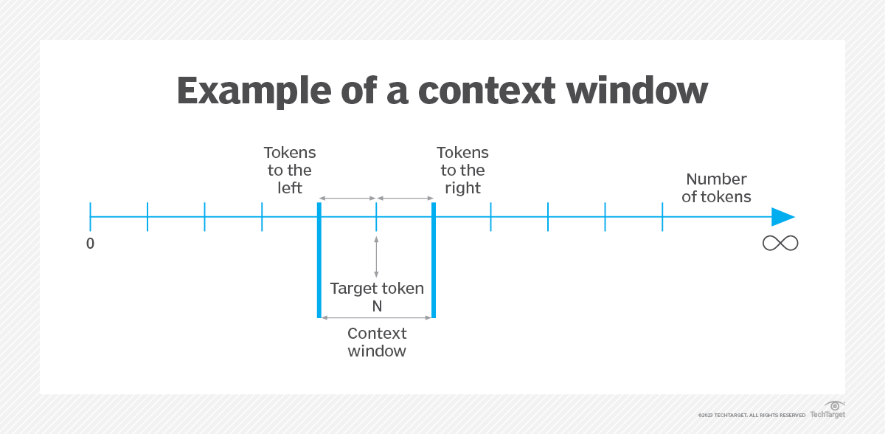
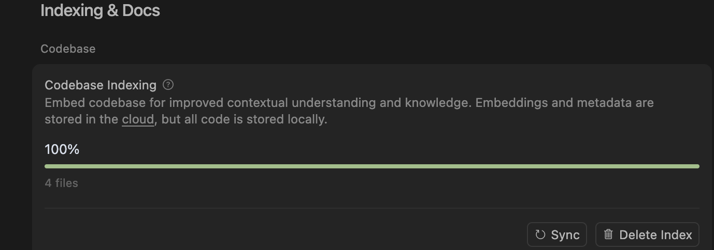
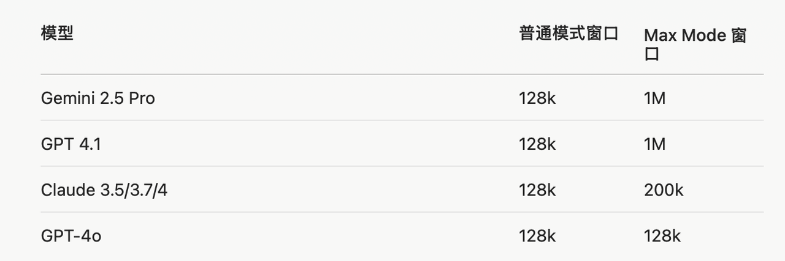
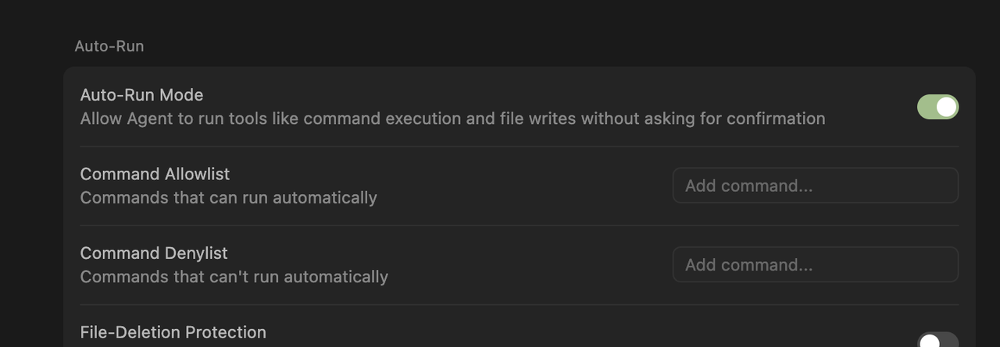
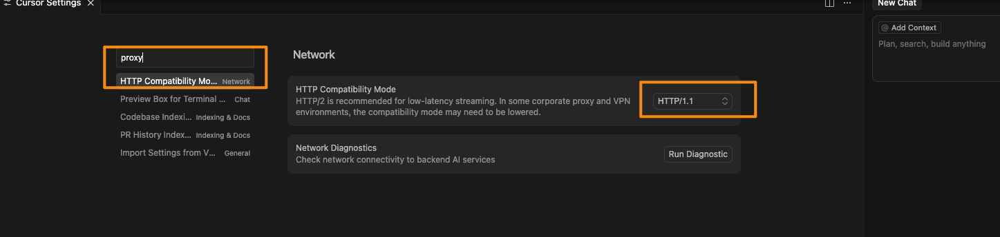
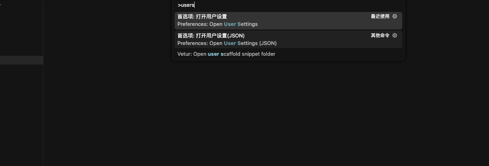
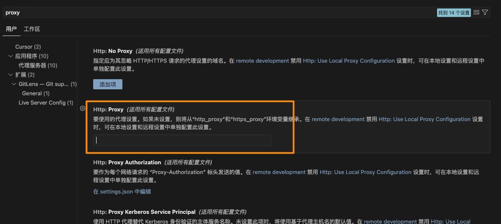
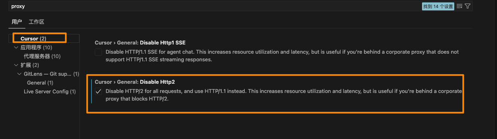

## Cursor的发展

Michael Truell与三位 MIT 同学——Sualeh Asif、Arvid Lunnemark 和 Aman Sanger——看准AI将重塑开发者工作方式的趋势，联手创办了 Anysphere

由几位麻省理工高材生在 2022 年创立，总部在纽约布法罗

并且已被包括英伟达（NVIDIA）、优步（Uber）和Adobe在内的超过一半的财富 500 强公司使用。

```sh
轮次 时间 融资金额 估值 主要投资者
种子轮 2023-07 $8M $56.5M 早期投资者
A轮 2024-08 $60M $400M OpenAI Startup Fund领投
B轮 2025-01 $105M $2.5B Thrive Capital、a16z领投
C轮 2025-05 $900M $9B Thrive Capital领投
```


```sh

## 2023
2023-07 融资800万美元，估值达到5650万美元。

## 2024
2024-08-23 A轮融资中筹集到了6000多万美元，估值4亿美元 首轮融资由OpenAI Startup Fund领投，BoxGroup、GitHub前首席执行官Nat Friedman和Dropbox联合创始人Arash Ferdowsi参投。

## 2025
2025-01-17 1月中旬左右Cursor 宣布 1.05 亿美元 B 轮融资（1月份估值达 25~26 亿美元

2025-05 完成了高达9亿美元的C轮融资 估值 90～100亿美元，相比于去年年底完成的B轮融资直接飙升了380% 本轮由Thrive Capital领投，Andreessen Horowitz、Accel和DST Global等参投

```

## ARR

Cursor成为历史上最快达到5亿美元ARR的公司，这一切还是建立在“0”营销费用的基础上

Annual Recurring Revenue，年经常性收入
最近一个月的经常性收入 × 12

## 上下文



LLM：指的是人工智能模型

Token：LLM的输入和输出

上下文：Token的输入和Token的输出，其中包括文件、符号和对话历史记录

自然语言语句：模型不会一次性阅读整个句子/用户提示词/文本，比如“按钮修改为红色”，这个句子模型会拆分，进行分词的操作

文本是如何分词：

https://tiktokenizer.vercel.app/


上下文，它决定了模型在对话中一次可以“记住”和处理多少信息，大概分为：意图上下文和状态上下文

### 意图上下文

表述将要做什么事情，意图是什么，比如：将按钮由现在的颜色修改为红色


### 状态上下文

还有一种是状态上下文：

换句话说，是事实存在的。比如提供错误消息、控制台日志、图像和代码块

### 上下文构建的方式

上下文信息通常是两部分得到的：1个是用户主动提供的，1个是Cursor 这个工具通过搜索代码等方式收集得到的。

Cursor 会开始学习您的代码。这被称为“索引”



模型会自动评估，结合对话，从当前文件或者其他文件中获取相关的信息

不过，必要的是用户手动明确已知的任务，而不是让模型自行猜测。

两个例子：

1、 修改一下按钮的圆角

2、把按钮的圆角修改为 10px

会出现问题的结合：上下文信息不足 + 模型的型号较为老旧比如 claude-3.5-sonnet

上文说到一部分是是通过用户提供的，可以使用 `@-symbol`

| @      |                      |
| ------ | -------------------- |
| @code  | 某一段代码           |
| @file  | 可能包含无关的上下文 |
| @foler | 大量无关的上下文     |

### 总结

提高编码的效果，需要确定你想要什么 & 已经存在的什么（比如控制台的网络请求结果）
过少的上下文（模型能力不足的情况）容易幻觉；或者过多的上下文又会稀释
使用 @Files & Folders 来缩小上下文范围

上下文的信息：包括您的代码 对话、回复、以及文档或者提供额外的上下文

不同的模型的上下文长度不一样

拥有一个大的上下文窗口（例如 Claude 的 200k token）并不意味着你应该完全填满它。就像一个杂乱的白板一样，过多的信息会让你更难专注于重要的事情。

## 模型选择

> 我们希望 AI 能“开箱即用”；我们意识到我们的模型和产品线已经变得多么复杂。
> 我们和你一样讨厌模型选择器，并希望回归神奇的统一智能。
> -- Sam Altman

开发者，理应根本不应该为模型的选择分心。
AI 编码助手的承诺是轻松提高效率。最好的助手能够无缝集成，提供智能的、上下文感知的建议，并且能够直接使用。模型选择器将这种负担转移给了开发者——迫使他们做出一个他们无法胜任的决定。
但是作为Cursor来讲，产品上的确提供了很多的选项，不过需要澄清：

- 最新模型不一定最好
  - 即使是最好的模型，如果没有正确的上下文也会举步维艰
- 没有提供正确的信息，仅仅在模型之间切换是无济于事的

20美元买的 Cursor 虽然大多数主流模型都支持，不过不同的任务，可能需要不同的模型。

本质的原因是：模型厂商的训练方式不一样。

- 有的先思考，再写代码
- 有的直接开始上来就写
- 有的先理解一下你的指示

自信的模型： gemini 的新型号和 claude 的 sonnet 型号
好奇的模型： o3 或者 claude opus

思考模型：
你的提示少，模型可能会主观一些
探索想法、进行广泛重构或希望模型更独立地运行时

非思考模型：如果某些任务是确定的
进行精确、受控的更改、需要更多提示、

Planning then

### 怎么在模型池中选择

如何在模型池中选择：

- 修复一个非常棘手的Bug：可以使用o3
- 理解超长上下文的代码文件（比如几千行的代码）：Gemini
- 明确知道自己要修改什么内容：可以使用 sonnet Gemini
- 规划并执行一个较为完整的任务：opus

## 文档的使用

本质的原因是大语言模型的训练知识的截止时间。一般都是过去式。会有几个问题：

- 解决同一问题的最近的方案不知道
- 新的框架不知道
- 某项技术的API已经废弃了⚠️
- 解决问题的最佳实践已经变化了
  等等

三种方式：

| 方式  |        | ｜                                                        |
| ----- | ------ | --------------------------------------------------------- |
| @docs | 读文档 | 框架怎么入门的，API的函数签名、一些框架的官方问题故障排除 |
| @web  | 搜一下 | 会搜索实时互联网，查找当前信息、博文和社区讨论            |
| MCP   |        | 内部的文本信息                                            |

## 学会舍弃

### 忽略模型不需要的信息

与 .gitignore 类似，它使用匹配来指定哪些文件应被排除在 Cursor 的上下文和操作之外。
要学会适当的忽略整个文件中不必要的文件：忽略大型内容文件可提高答案准确性。或者需要时引用它们，但又不想让光标索引所有这些文件
这些索引的内容：索引的代码库在 6 周不活动后会被删除

Tip : 学会忽略不必要的文件和图片，不过Cursor已经有一份默认的忽略规则
这样做的目的有几个：

- 降低噪音：排除自动生成的文件、构建产物和其他非必要内容
- 提高性能：限制Cursor 需要处理的代码量
- 集中注意力：将Cursor 指向代码库的相关部分

### 不妨新建立一个窗口

Cursor 中的每次聊天都维护自己的上下文窗口。会话中包含的提示、附加文件和响应越多，上下文窗口就越大。这就会导致诸多问题：
比如修复一个问题，修复的越来越乱。不妨新建立一个窗口 @Past Chats 可以关联之前的窗口，不同的标签页维护着自己的上下文、历史记录和模型选择
在 Cursor 中，普通模式下大多数模型的上下文窗口是 128k tokens（大约1万行代码）。开启 Max Mode 后，部分模型（如 Gemini 2.5 Pro 和 GPT 4.1）的上下文窗口可以扩展到 1M tokens（约100万 tokens），也就是普通模式的8倍。


Tip 当前窗口遇到问题了，不妨新建立一个窗口“从头开始”

## Plan & Act 规划与行动

### 培养规划与行动模式的习惯

在实施前进行周密的规划。这种双模式系统有助于开发人员编写更易于维护、更准确的代码，同时缩短迭代时间。
Tip: 规划模式去思考，行动模式去构建

### 做任务时的技巧 Prompting Cursor

- 做事情之前，比较复杂的任务先思考再去做
  - 可以先 Gemini 预先咨询一下方案思路，接着按照上述的模型选择，交给模型去做
- 分解复杂性：避免一次性较大的任务，可以适当拆解为小任务
- 为每个不耦合的任务开启单独的上下文窗口
- 并行执行不同的任务：
  - `Command + T` 开启不同的窗口，让Cursor背后同步执行多条任务
- 约束填充：
  - 为缓解代码截断问题，请在提示中包含明确的约束。例如，“确保代码完整”或“始终提供完整的函数定义”。

### 勤用 Git

由于AI修改代码，存在不准确性，当完成某次确定的任务，及时暂存代码
Tip 勤用Commit

## 功能细节

### Auto-Run Mode

这种模式 以自动化方式执行的操作设置精细的权限，在还不熟练使用Cursor的时候，不妨尝试从手动开始
这样会给我们一个在每一步都审查更改的机会，当然随着你对Cursor能力越来越信任，您可以逐步增加权限，以匹配自己的舒适度。



### 拖放

将文件拖放到Cursor的对话中 是添加图片、代码和其他文件的快捷方式，这往往是让人容易忽略的

## 地区限制

背景可以看官方文档： https://docs.cursor.com/account/regions 由于模型厂商的地区限制问题，导致中国大陆使用Cursor 出现问题

### 解决办法

在 Cursor的设置中，把 HTTP2 修改为 HTTP1.1


如果还不可以的话



`Command + Shift + P` 打开设置，然后搜索 **proxy** 配置一下编辑器的本地代理，比如 http://127.0.0.1:7890 其中7890是端口，需要和你的代理软件代理的端口一致



