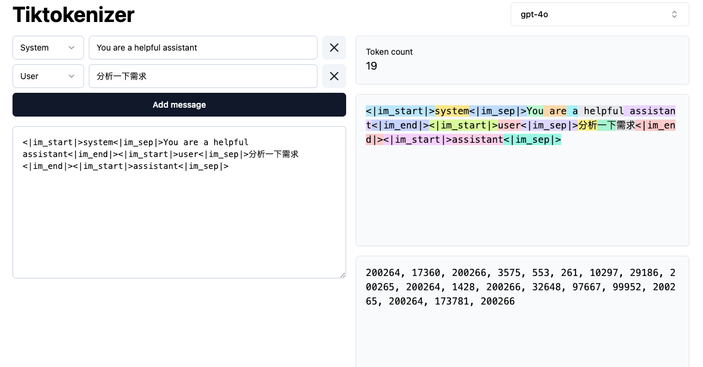
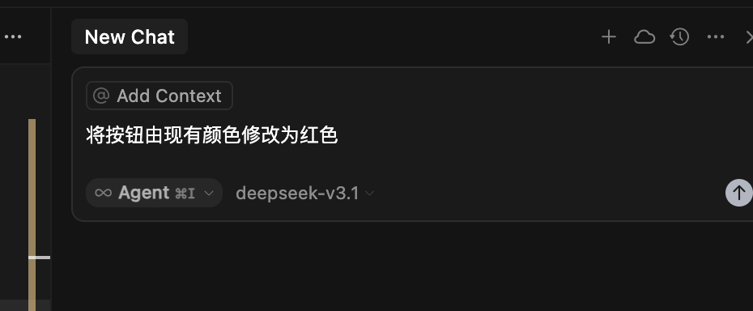

## 上下文

LLM 人工智能模型

Token 之前的 token 来预测下一个 token

上下文指的的是：token的输入和token的输出

意图上下文：

还有一种是状态上下文：

换句话说，是事实存在的。比如提供错误消息、控制台日志、图像和代码块

上下文信息通常是两部分得到的：1个是用户主动提供的，1个是Cursor 这个工具通过搜索代码等方式收集得到的。

模型会自动评估，结合对话，从当前文件或者其他文件中获取相关的信息

不过，必要的是用户手动明确已知的任务，而不是让模型自行猜测。

两个例子：

1、 修改一下按钮的圆角

2、把按钮的圆角修改为 10px

会出现问题的结合：上下文信息不足 + 模型的型号较为老旧比如 claude-3.5-sonnet

上文说到一部分是是通过用户提供的，可以使用 `@-symbol`

| @      |                      |
| ------ | -------------------- |
| @code  | 某一段代码           |
| @file  | 可能包含无关的上下文 |
| @foler | 大量无关的上下文     |

### 总结

提高编码的效果，需要确定你想要什么 & 已经存在的什么（比如控制台的网络请求结果）
过少的上下文（模型能力不足的情况）容易幻觉；或者过多的上下文又会稀释
使用 @Files & Folders 来缩小上下文范围

## 模型选择

20美元买的 Cursor 虽然大多数主流模型都支持，不过不同的任务，可能需要不同的模型。

本质的原因是：模型厂商的训练方式不一样。

- 有的先思考，再写代码
- 有的直接开始上来就写
- 有的先理解一下你的指示

自信的模型： gemini 的新型号和 claude 的 sonnet 型号
好奇的模型： o3 或者 claude opus

思考模型：
你的提示少，模型可能会主观一些
探索想法、进行广泛重构或希望模型更独立地运行时

非思考模型：如果某些任务是确定的
进行精确、受控的更改、需要更多提示、

### 总结

如何在模型池中选择：

- 修一个非常棘手的bug o3
- 理解超长的代码库 gemini
- 明确知道自己修改什么 sonnet gemini
- 规划解决一个问题 opus

## 文档

本质的原因是大语言模型的训练知识的截止时间。一般都是过去式。会有几个问题：

- 解决同一问题的最近的方案不知道
- 新的框架不知道
- 某项技术的API已经废弃了⚠️
- 解决问题的最佳实践已经变化了
  等等

三种方式：

| 方式  |        | ｜                                                        |
| ----- | ------ | --------------------------------------------------------- |
| @docs | 读文档 | 框架怎么入门的，API的函数签名、一些框架的官方问题故障排除 |
| @web  | 搜一下 | 会搜索实时互联网，查找当前信息、博文和社区讨论            |
| MCP   |        | 内部的文本信息                                            |

## 多任务并行

尽可能是不耦合的多个任务，在同一时间执行。 `Command + T`

## 小技巧

- 先思考计划 再去 做：心智是和人做任务的时候一致，先Gemini 预先咨询一下方案思路，接着按照上述的模型选择去做。
- 避免一次性处理大任务：可以适当的拆解小任务
- 为每个不耦合的任务开启单独的上下文窗口
- cursorindexignore 需要时引用它们，但又不想让光标索引所有这些文件
